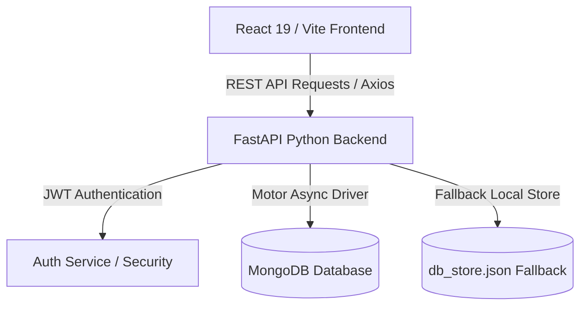

# KVGCE TAP — System Architecture Documentation

## Overview
KVGCE TAP (Activity Tracking & Management System) is an integrated academic skill assessment, activity verification, placement preparation, and role-based administration platform.

## Architecture Layers

### Components
1. **Frontend (React 19 + Vite)**:
   - Dynamic role-based routing (Student, Faculty, Admin).
   - Component hierarchy with atomic design (`components/common`, `layout`, `profile`, `academics`, `assessment`, `skills`, `placement`, `ai`).
   - Global auth state management via `AuthContext`.

2. **Backend (FastAPI)**:
   - High-throughput asynchronous routing.
   - Pydantic v2 schemas for payload validation.
   - Passlib + Bcrypt password hashing & PyJWT token generator.

3. **Database Layer (Dual Strategy)**:
   - Production: MongoDB via Motor async driver.
   - Development / Offline: Automatic JSON file fallback store (`db_store.json`).
